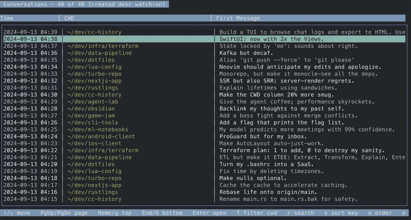

# cc-history-rs — Claude Code Session History TUI

A fast, keyboard‑driven terminal UI for exploring your local Claude Code session history.

It reads session logs from `~/.claude/projects/**/<sessionId>.jsonl`, presents a sortable conversation list (Time | CWD | First Message), and lets you open a chat to read with search and code‑aware formatting. You can export any conversation to a clean HTML file.



---

## Features

- Conversation list
  - Columns: Time, CWD (home shortened to `~`), First Message (first non‑empty User message)
  - Lazy previews: first message is populated only for rows on screen (keeps startup snappy)
  - Global search across all conversations (`/`)
    - Filters the list to conversations with at least one match
    - Runs in the background; title shows `[search: '…' searching…]` while running
    - On completion, title shows `[search: '…' — N matches — x to clear]`
  - Live updates (watch mode):
    - The list auto‑refreshes when files in `~/.claude/projects` change
    - Toggle on/off with `w`; title shows `[watch:on]` / `[watch:off]`
    - Preference persists to `~/.config/cc-history/config.json`
    - Title shows `updating…` while a refresh is in progress
  - Preferences that persist in `~/.config/cc-history/config.json`:
    - Watcher on/off (`watcher`)
    - Sort key/order (`sort_key`, `sort_desc`)
    - Current CWD filter (`filter_path`)
    - Claude command (`claude_command`)
  - Filter by CWD (`f`), clear filter/search (`x`)
  - Sorting (async, non‑blocking):
    - Default sort: newest session first (created desc)
    - Cycle sort key (`s`): created → path → last‑message → created
    - Toggle order (`o`): asc/desc
    - Title shows current sort and a “sorting…” indicator while resorting

- Chat view
  - Simple Markdown‑ish rendering, inline code styling
  - Code fences preserved; tool invocation/output rendered clearly
  - Search with `/` (type → Enter), navigate results with `n` (next) / `N` (prev)
  - Current match line highlighted (yellow background + black text)

- Tool result handling
  - Empty tool results omitted (no stray headers)
  - Edit tool (name `Edit`) parsed specially: shows unified diff between `old_string` and `new_string` with `diff` code fence

- Session info modal
  - Press `i` to view detailed information about the selected conversation
  - Shows session ID, project path, file path, creation date, last message date, and message count
  - Modal appears as an overlay and can be closed with `Esc`

- Settings modal
  - Press `,` (comma) to open settings configuration
  - Configure Claude command (defaults to "claude")
  - Press `Enter` to edit the command, `Enter` again to save, `Esc` to cancel/close
  - Settings persist to `~/.config/cc-history/config.json`

- Session resumption
  - Press `r` to resume the selected session in Claude Code
  - Executes the configured Claude command with `--resume <session_id>` in the session's project directory
  - Supports command switches (e.g., `claude --verbose` becomes `claude --verbose --resume <session_id>`)
  - Application exits after launching Claude (does not return to browser)
  - Terminal state is properly restored for the launched session
  - Displays informational message showing the command executed and directory used

- Export
  - Export current conversation to `exports/conversation-<id>.html` (`e`) and open in default browser
  - Tool results are collapsed in `<details>` sections to keep pages readable

---

## Quick start

Requirements:
- Rust (stable) with `cargo`
- macOS or Linux terminal (TrueColor/TMUX compatible works best)

Build and run:
```
cd cc-history-rs
cargo build
cargo run
```

The app will look for Claude session logs under `~/.claude/projects`. If none are found you’ll see an empty list.

Using a custom projects directory:
- Run with `--projects-dir <path>` to point at a different projects folder.
- Example with included demo data: `cargo run -- --projects-dir cc-history-rs/demo_data/projects`
- Demo data uses `cwd` under `/Users/js/...` so `~` abbreviation appears on that system.

---

## Key bindings

List view:
- Up/Down: move selection
- PgUp/PgDn: page
- Home / g: go to top
- End / G: go to bottom
- Enter: open selected conversation
- f: filter to selected CWD
- x: clear filter and search
- /: global search across all conversations (type → Enter to run; Esc cancels input)
- w: toggle file watcher (live updates)
- s: cycle sort key (created → path → last‑message)
- o: toggle sort order (asc/desc)
- i: show session info modal
- , (comma): open settings modal
- r: resume session in Claude Code
- e: export to HTML and open
- q: quit (only when not typing a search)

Chat view:
- Up/Down: scroll one line
- PgUp/PgDn: page scroll
- Home / g: go to top
- End / G: go to bottom
- `/`: start a search (type → Enter to confirm; Esc cancels input)
- n / N: next / previous match
- e: export to HTML and open
- Esc / q: back to list (when not typing a search)

---

## Data model

- Source: `~/.claude/projects/**/<sessionId>.jsonl`
- `ChatReader` provides:
  - `list_conversations()` → id, cwd path (if present), approximate creation time
  - `get_messages_by_id(id)` → flattened sequence of `{role, content}` messages
  - `earliest_message_time_ms(file)`, `latest_message_time_ms(file)` for sorting
- First message preview logic prefers the first non‑empty User message; falls back to first non‑empty of any role.

---

## Rendering

- List header is aligned to column widths calculated for the current terminal size.
- CWD column is truncated/padded safely and replaces your home directory with `~`.
- Chat messages are rendered with minimal styling that preserves content and line breaks.
- Tool events:
  - `Edit` tool shows a unified diff with a `diff` code fence
  - Tool results with no content are omitted

---

## Export to HTML

`e` in list or chat view writes `exports/conversation-<id>.html` and opens it in your default browser.

- Markdown is rendered to HTML (headings/lists/inline code/quotes/code blocks)
- Tool results are collapsed using `<details><summary>Tool Result (N lines)</summary>…</details>`
- Uses simple, readable CSS that works in light/dark mode

---

## Performance & UX

- Lazy loading of message previews avoids scanning the entire history on startup
- Sorting runs asynchronously; the UI remains responsive and shows a “sorting…” badge in the title while results compute
- Chat search works on a plain‑text mirror of the view to avoid ANSI/style complexity

---

## Troubleshooting

- “No conversations found”: ensure `~/.claude/projects` exists and contains `*.jsonl` session files
- Slow resorting on large histories: sorting is done in the background; a temporary “sorting…” indicator will be shown until complete
- Terminal issues (colors/borders): try a 24‑bit color‑capable terminal, or check tmux config for truecolor support

---

## Project layout

```
cc-history-rs/
├─ src/
│  ├─ main.rs          # TUI, keybindings, search, sorting, export, layout
│  └─ chat_reader.rs   # Log discovery, JSONL parsing, message flattening, time helpers
├─ Cargo.toml          # Dependencies: ratatui, crossterm, chrono, pulldown-cmark, similar, open, etc.
└─ README.md           # This file
```

---

## Roadmap / Ideas

- Inline substring highlighting (not just full‑line) for search matches
- Configurable column widths and visible columns
- Persist sort/filter preferences between runs
- Richer syntax highlighting via `syntect` (optional feature)

---

## A note on privacy

This tool reads your local Claude logs under `~/.claude/projects`. No data is sent anywhere. Exported HTML files are written under `./exports/` in your current working directory.

---

## License

MIT License
